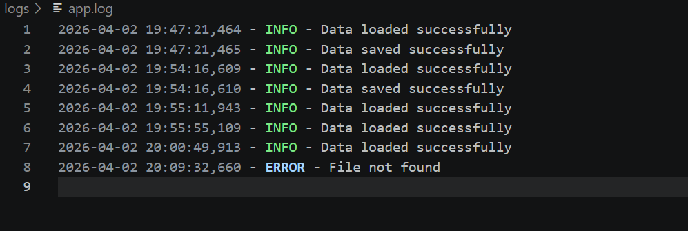
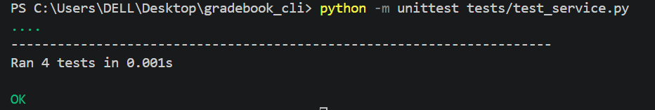

# Gradebook CLI

##  Project Description
A command-line Gradebook application built in Python that allows users to manage students, courses, enrollments, and grades

## Setup

1. Clone the Repository 

git clone https://github.com/MaltineR/gradebook_cli.git

2. Create virtual environment:
```bash
python -m venv venv
```
## Run the seed.py file (Sample Data)

```bash
python -m scripts.seed
```
## CLI commands
### Add Student 
```bash
python main.py add-student --name "Maltine"
```
### Add a Course 
```bash
python main.py add-course --code OS101 --title "Operating Systems"
```
### Enroll a Student
```bash
python main.py enroll --student-id 1 --course OS101
```
### Add a Grade
```bash
python main.py add-grade --student-id 1 --course OS101 --grade 90
```
### List students, courses or enrollments 
```bash
python main.py list students
python main.py list courses
python main.py list enrollments
```
### Get Average Grade of a Course 
```bash
python main.py avg --student-id 1 --course OS101
```
### Get GPA of a Student 
```bash
python main.py gpa --student-id 1
```
## Expected Outputs (Screenshots)

### CLI Output


### Logging Output


### Unit Tests Output


## Design Decisions & Limitations

- Data is stored in a JSON file (`data/gradebook.json`)
- Service functions are functions that take data as input and return new data
- Student IDs are auto generated based on the number of students
- Grades must be between 0 and 100
- No delete functionality implemented yet — cannot delete students, courses or grades
- Data is not encrypted — the JSON file can be opened and edited manually
- Logging only tracks load and save operations, not every individual action

